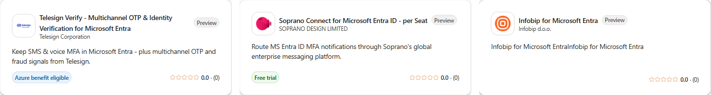
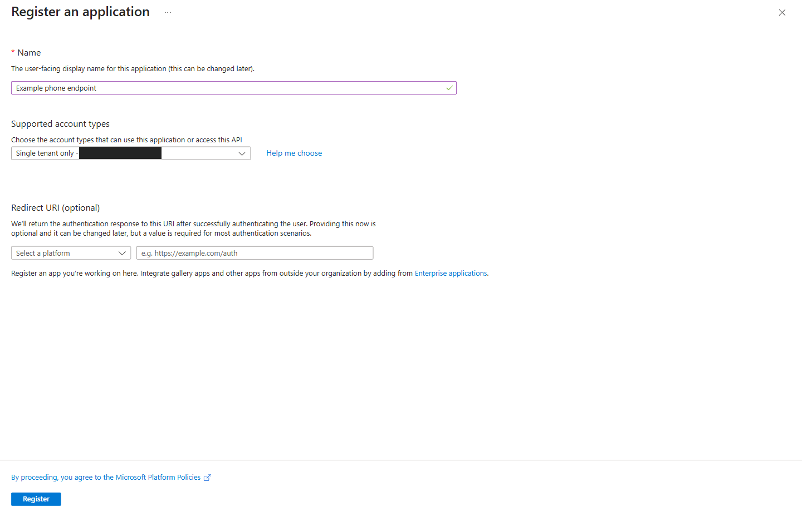
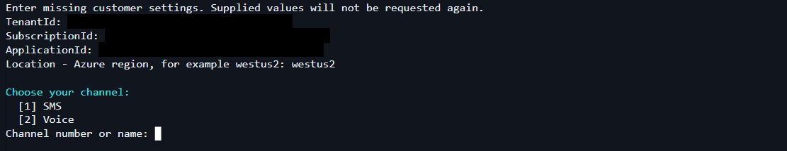
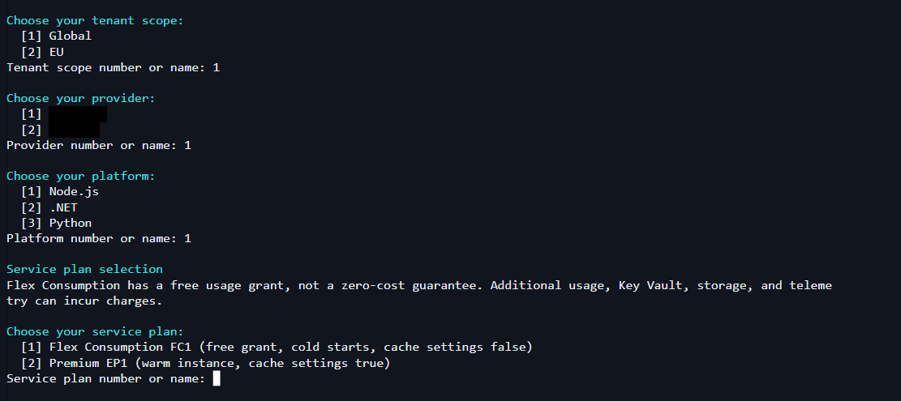
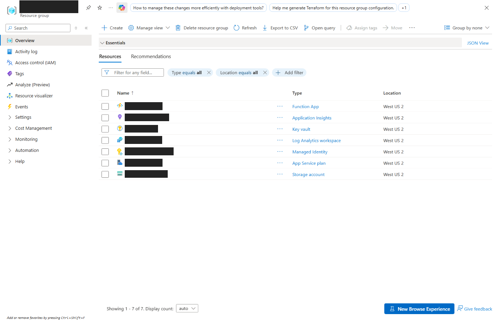
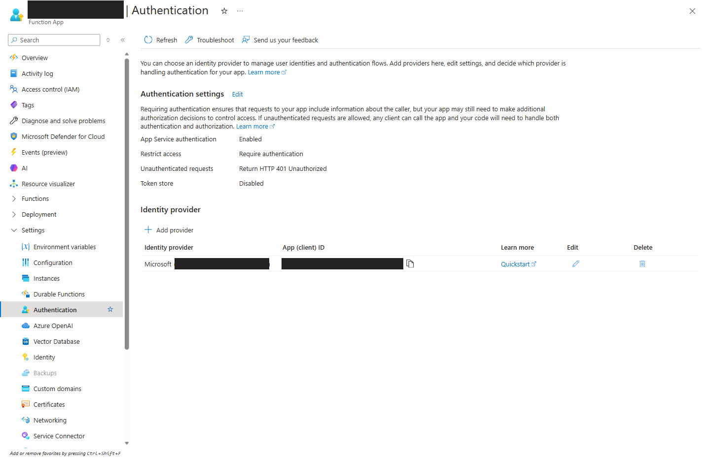

# External Phone Provider: Azure Function Sample

Connect Microsoft Entra ID to your phone provider to send one-time passwords by SMS or voice.
This guide walks you through **one endpoint in one Azure region**.

You register an application, run a guided setup script, then connect and test your provider.
An administrator activates the endpoint only after those checks pass. You do not need to clone
this repository, build locally, or follow all three language guides.

The screenshots below show the Azure portal; the same app registration is available in the
Microsoft Entra admin center. Account details and resource names have been permanently hidden.
Your portal layout may look slightly different.

## 1. Get ready

Start in a **dedicated nonproduction tenant and subscription**.

Before purchasing or deploying, confirm access to a supported provider's EPP integration through
[Microsoft Security Store](https://securitystore.microsoft.com/private-solutions). Arrange
Microsoft's approved testing and activation procedure with your tenant administrator.
Buying an offer does not enable the tenant feature or deploy this sample. If access or the
approved procedure is unavailable, **stop here** and follow the
[access and support guidance](docs/ONBOARDING.md#before-purchasing-or-deploying).

In Security Store, open **Private solutions** and select the subscription approved for your
deployment. Review the phone-provider offers available to that subscription.



*These are cropped sample cards from Security Store, not recommendations or a complete provider
list. Offers, preview labels, pricing, and access can change. A store listing does not mean the
setup script supports that integration; check [guided provider support](docs/ONBOARDING.md#provider-credential-names).*

Have these ready:

- **Provider account:** complete the provider's account and sender registration for your chosen
  SMS or voice service. Check [guided provider support](docs/ONBOARDING.md#provider-credential-names).
- **Workstation:** Windows, PowerShell 7+, and Azure CLI 2.60.0+ for Flex Consumption (FC1),
  or 2.48.1+ for Premium (EP1). Allow access to GitHub, Azure, Microsoft Graph, Key Vault, and
  the deployment endpoints. C# also needs the .NET 8 SDK and NuGet access.
- **Administrators:** an Azure operator with subscription deployment, resource-provider registration,
  and role-assignment permissions; an Entra Privileged Role Administrator for setup; and an
  Authentication Policy Administrator for later activation. These are separate permissions.
- **Azure region and budget:** check availability and subscription quota for your chosen Linux
  plan. Azure resources and provider services can incur charges.

Review the [full prerequisites](setup/docs/README.md#prerequisites-for-step-2), including the
required Entra allowed-tenants preview, before running setup. The script can install missing
Graph modules and Bicep after confirmation; Azure CLI must already be installed.

Choose an **onboarding owner** in your organization to coordinate the administrators, provider,
and Microsoft support. This is a sample, not production certification: it does not provide
automatic send retries, duplicate-send protection, or automatic certificate renewal.
Review the [production limitations](docs/CONTRACT.md#production-limitations) with that owner.

## 2. Register your application

In the customer tenant's **Microsoft Entra admin center > App registrations > New registration**:

1. Give the application a recognizable name.
2. Select **Accounts in this organizational directory only**. Leave the redirect URI blank,
   then select **Register**. Setup will make the app organizational multitenant and restrict
   its allowed tenants after you approve the deployment plan.
3. On **Overview**, save the **Directory (tenant) ID** and **Application (client) ID** privately.
   Use the client ID, not the Object ID.



*Some portal versions label the account type **Single tenant only**. Choose your own directory.
The example above is an unsaved form, not an application you can reuse.*

Do not add a client secret, API permission, or app role yourself; setup handles the remaining
configuration. See [application registration details](setup/docs/README.md#step-1---manually-create-the-application).

Also keep your Azure subscription ID handy. The
[setup values worksheet](docs/ONBOARDING.md#inputs-you-supply-to-setup) explains where to find
each value. Use a new dedicated application and resource prefix for another independent endpoint;
changing the channel or region on a rerun does not create a separate deployment.

## 3. Run guided setup

Open **PowerShell 7** in a folder where you want to keep the script and deployment summary.
Download the script:

```powershell
Invoke-WebRequest `
    -Uri 'https://raw.githubusercontent.com/Azure-Samples/ExternalPhoneProvider-AzureFunction-Sample/main/setup/Setup-Epp.ps1' `
    -OutFile .\Setup-Epp.ps1
```

Review the downloaded script, then run it:

```powershell
.\Setup-Epp.ps1
```

On a shared or multi-account workstation, use `.\Setup-Epp.ps1 -ForceAuthentication` to request
explicit Azure and Microsoft Graph sign-in.

Follow the prompts for your tenant, subscription, application, Azure region, provider, and channel.
Choose **one** language: JavaScript, C#, or Python. Setup downloads and verifies the package,
builds it if needed, and deploys it for you; you do not need a separate ZIP upload or local settings file.



*Enter your own values from Step 2. These are captures of the real script's terminal output,
not example deployment results.*

Choose **FC1** for on-demand hosting that can scale to zero, or **EP1** for paid warm capacity.
FC1 can cold-start, and its free usage grant does not make the whole deployment free.
See [hosting plan details](setup/docs/README.md#service-plan-selection).
The **Global/EU** prompt is a provider route label, not your Azure region or a data-residency guarantee.
For the resource prefix, use 2-8 lowercase letters or digits, starting with a letter.



*Choose the options approved for your deployment; do not copy the example selection numbers.
The Global/EU choice is not the Azure region. The hosting-plan warning applies even when a
plan has a free usage grant.*

Next, setup checks prerequisites, signs in to Azure and Microsoft Graph when needed, verifies
the selected package, and prepares the deployment plan. Complete sign-in and MFA yourself.
If a permission or prerequisite check fails, stop and resolve it before continuing.

**Review the complete deployment plan before typing `Yes`.** Check the accounts, region,
provider route, plan, resource names, permissions, and certificate changes. Setup grants the
Microsoft phone-provider service principal Microsoft Graph `Application.Read.All`, a tenant-wide
application-read permission. `No` or Enter cancels deployment; sign-in and prerequisite prompts
are separate from this approval.

**Want to review without deploying?** Run interactively and choose **No** at that final prompt.
There is no `-DryRun` or `-WhatIf` switch. This is not an offline dry run: sign-in, prerequisite
checks, downloads, and template compilation happen first. Do not pass `-ApproveDeployment`
when you only want to review the plan.

After you approve, leave the script running while it configures the application, creates the
Azure resources, sets up encryption and authentication, and publishes the code. Wait for
**Deployment completed** and the saved summary before moving to Step 4. The input screenshots
above do not show or prove that this deployment stage completed.

On success, setup has created the Function App, storage, Key Vault, identities, and monitoring
resources, and published the endpoint code. **Do not create these resources manually first.**
Keep the public certificate and timestamped summary in `epp-output` beside the script.
Use the [summary field guide](setup/docs/README.md#read-the-deployment-summary) to find your
resources, endpoint URL, application client ID, and encryption key ID. No private key is downloaded.

Setup verifies **Easy Auth**, the endpoint's caller-authentication protection, before opening
public access. Never disable it to fix a setup or testing problem. If setup fails, use the
[troubleshooting guide](setup/docs/Troubleshooting.md) rather than deleting resources and starting over.

To find the deployed resources, open **Azure portal > Resource groups** and select the group
listed in your deployment summary.



*This existing Premium test deployment shows the resource types to look for, not a new
deployment or a guarantee that your resource list will be identical. Use setup rather than
the portal's Create button to deploy the endpoint.*

## 4. Connect your provider and test

Complete the [provider authentication instructions](docs/ONBOARDING.md#complete-provider-authentication)
for your selected integration. This means either entering credentials in the setup-created Key Vault
or having the provider administrator authorize the application. Azure deployment alone does not
complete that step. Keep credentials out of source code, screenshots, and shared logs.

For an API-key integration, open the Key Vault named in your deployment summary, then select
**Objects > Secrets > Generate/Import**. Enter each credential under the exact secret name
required by your provider. The [illustrated Key Vault steps](docs/ONBOARDING.md#where-to-enter-api-key-credentials-in-key-vault)
show the location and an unsaved example. OAuth integrations use the provider-administrator
handoff instead; do not create an API-key secret for them.

In your Function App, open **Settings > Authentication**. Check that authentication is
**Enabled**, access is set to **Require authentication**, and unauthenticated requests receive
**HTTP 401 Unauthorized**. These are checks, not instructions to change the approved caller.



*The **Microsoft** identity provider on this page validates the caller. It is not the phone
provider you selected for SMS or voice.*

Ask your onboarding owner to arrange the
[approved deployed-endpoint checks](docs/ONBOARDING.md#validate-the-deployed-endpoint):

1. Confirm that missing or unauthorized caller credentials are rejected.
2. Run an authorized **evaluation** to check authentication and decryption without a provider send.
3. Run a separately approved **live test** and confirm both provider acceptance and receipt of
   the SMS or voice call. Acceptance alone is not proof of delivery.
4. Check that the request and relevant logs appear in Application Insights.

The [illustrated monitoring steps](docs/MONITORING.md#find-the-linked-resources-in-the-portal)
show where to open Application Insights and its Logs workspace.

This repository does not supply a self-service token tool for the authorized Microsoft caller.
An ordinary Azure CLI token is not a substitute. If the approved test procedure is unavailable
or any check fails, **do not activate the endpoint**. Do not blindly retry a timed-out live send:
the provider may already have accepted it.

## 5. Activate and hand over

Have an **Authentication Policy Administrator** follow the
[supported activation procedure](setup/docs/README.md#step-3---manually-validate-and-activate-policy).
They must save the existing policy, apply the approved endpoint URL and application client ID,
preserve other settings, and read back and validate the change. **Setup does not activate policy.**
The EPP policy fields require Microsoft's assisted procedure; do not guess a Graph update.

Before handing over, confirm:

- [ ] Provider authentication, authorized testing, and recipient delivery are verified.
- [ ] Policy is backed up, activated, and checked, with a [rollback plan](setup/docs/README.md#rollback-and-decommissioning).
- [ ] [Monitoring and alert notifications](docs/MONITORING.md) work for your chosen runtime.
- [ ] Owners are assigned for provider credentials, [certificate renewal](setup/docs/README.md#encryption-certificate-lifecycle),
  support, and costs.

Setup creates telemetry resources, **not alert rules or renewal notifications**.
Keep the deployment summary and validation evidence in restricted storage.
Deleting Azure resources does not undo an authentication policy change.

## Find more detail

| When you need to... | Read |
|---|---|
| Check permissions, prompts, hosting plans, or renewal | [Setup reference](setup/docs/README.md) |
| Find IDs, add provider credentials, or run acceptance checks | [Customer configuration and validation](docs/ONBOARDING.md) |
| Resolve a setup or delivery problem | [Troubleshooting](setup/docs/Troubleshooting.md) |
| Find logs and set up alerts | [Monitoring](docs/MONITORING.md) and [Application Insights](docs/APPLICATION-INSIGHTS.md) |
| Understand the architecture, settings, or packages | [Technical reference](TECHNICAL.md) and [HTTP contract](docs/CONTRACT.md) |
| Explore multiple Azure regions | [Manual Front Door guide](docs/FRONTDOOR.md); not included in guided setup |
| Build a custom implementation | [JavaScript](javascript/README.md), [C#](dotnet/README.md), or [Python](python/README.md) |
| Design primary-to-secondary provider fallback | [Developer walkthrough](docs/MULTI-PROVIDER-IMPLEMENTATION.md); not a built-in feature |
