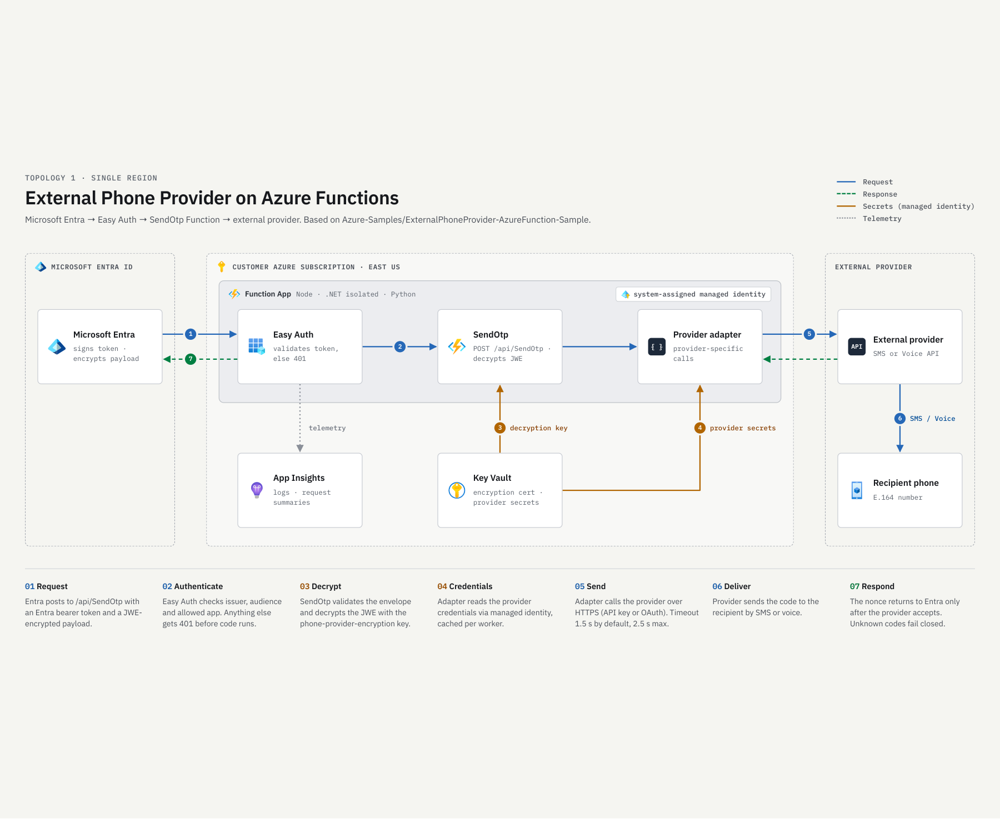

# External Phone Provider: Azure Function Sample

Deploy an External Phone Provider (EPP) endpoint on Azure Functions to deliver one-time passwords
by SMS or voice. Start here to onboard **one deployment in one Azure region**.

For implementation details, configuration, packaging, and security behavior, see the
[technical reference](TECHNICAL.md).

**New customer path:** [confirm access and collect values](docs/ONBOARDING.md#before-purchasing-or-deploying)
→ [run guided setup](setup/docs/README.md#step-2---download-and-run-one-script)
→ [connect and validate](docs/ONBOARDING.md#complete-provider-authentication)
→ [activate policy](setup/docs/README.md#step-3---manually-validate-and-activate-policy)
→ [operate and monitor](docs/MONITORING.md).
You do not need to build locally, create `local.settings.json`, or read all three language guides.

For a customer-built multi-provider customization, see the
[step-by-step implementation guide](docs/MULTI-PROVIDER-IMPLEMENTATION.md).

## Deployment options

| Option | Onboarding |
|---|---|
| Single region | Follow the steps below. `Setup-Epp.ps1` deploys one endpoint. |
| Multiple regions behind Azure Front Door | Follow the [manual guide](docs/FRONTDOOR.md). You'll need to configure the regions and implement a readiness endpoint yourself. We don't provide a Front Door setup script. |

## What you will set up

You will connect a provider account to a dedicated Azure Function endpoint, validate SMS or voice
delivery, and then have an administrator activate the endpoint in Microsoft Entra ID.

The guided setup deploys the Azure resources and configures the endpoint application. It does **not**
purchase a provider offer, grant access to a provider's API, or activate your authentication method
policy. Those steps remain part of your onboarding.

**Before spending or activating:** confirm access to the provider's EPP integration and Microsoft's
approved tenant onboarding/test procedure. The sample does not establish eligibility, licensing,
or preview enrollment. It is not production certification: it has no durable queue, automatic
send retries, deduplication, whole-request deadline, or overlapping key rotation. Review the
[limitations](docs/CONTRACT.md#production-limitations) with your owners.

## Single-region architecture



The single-region request flow is:

1. Microsoft Entra ID's Strong Authentication Service (SAS) sends an authenticated, encrypted request.
2. App Service Authentication (Easy Auth) validates the caller before the Function runs.
3. The Function decrypts the request using a key stored in Azure Key Vault.
4. The selected provider adapter authenticates to the phone provider and submits the SMS or voice message.
5. For a live request, the Function returns a success response after provider acceptance. Confirming delivery to the
   recipient is a separate validation step.

The diagram's delivery path describes **live requests**. An authorized, valid encrypted
**evaluation request (`mode: 2`)** returns the matching nonce without submitting a message to the
provider. Background credential refresh can still run independently. Authentication failures may
return **401 or 403**; neither is a successful evaluation.

**East US in the diagram is illustrative, not a required or guaranteed deployment location.**
Choose a region with capacity and subscription quota for the selected Linux FC1 or EP1 plan.

Application Insights provides operational telemetry. Provider API keys stay in Key Vault; supported
OAuth integrations use managed identity. The guided steps below cover the single-region topology
shown above. For one public URL backed by multiple regional origins, see the
[manual Front Door option](docs/FRONTDOOR.md), including the request failures seen during testing.

## Before you start

Use a **dedicated nonproduction tenant and subscription** for your first deployment.

| Requirement | What to prepare |
|---|---|
| Provider | An offer from [Microsoft Security Store](https://securitystore.microsoft.com/private-solutions), with the required SMS or voice route, account/sender registration, and EPP account access. Guided setup supports Telesign and Soprano only. |
| Workstation | Windows with PowerShell 7+ and Azure CLI 2.60.0+ for FC1 or 2.48.1+ for EP1 on `PATH`. Certificates are issued inside Key Vault, not the local certificate store. End-to-end setup from Linux or Azure Cloud Shell has not been validated. |
| Network access | Access to GitHub, Azure, Microsoft Graph, and Key Vault. FC1 publication and EP1 Python builds also require access to the Function's SCM endpoint. |
| Azure permissions | An Azure user account permitted to deploy at subscription scope, register required resource providers, and create scoped role assignments. |
| Microsoft Entra permissions | A Privileged Role Administrator for the application and Microsoft Graph configuration. Setup uses the allowed-tenants preview and requires Microsoft Graph beta access. |
| Policy activation | An Authentication Policy Administrator to activate the endpoint after validation. Deployment alone does not activate it. |
| Region and hosting | A region supporting the selected Linux FC1 or EP1 plan with sufficient subscription quota. Resource-provider registration does not grant quota. Deployed resources can incur Azure charges; review the hosting plan before approval. |
| C# only | The .NET 8 SDK and NuGet access. Setup builds and publishes the selected .NET package automatically. |

Setup can install missing Microsoft Graph PowerShell modules and the Azure CLI Bicep component
after confirmation. Azure CLI itself must already be installed. JavaScript and Python do not
require a local build toolchain for this guided deployment; Python dependencies are built in Azure.

Review the complete [setup prerequisites](setup/docs/README.md#prerequisites-for-step-2) before
deploying. If Azure reports `SubscriptionIsOverQuotaForSku`, follow the
[regional quota troubleshooting steps](setup/docs/Troubleshooting.md#deployment-fails-with-subscriptionisoverquotaforsku)
before retrying.

The customer-designated **onboarding owner** coordinates the Azure operator, tenant/policy
administrator, provider administrator, and Microsoft support. This repository does not supply
a named contact. If the offer or required feature/test procedure is unavailable, follow the
[access gate](docs/ONBOARDING.md#before-purchasing-or-deploying), not a workaround that weakens authentication.

## Onboard your endpoint

### 1. Set up your provider and application

In [Microsoft Security Store](https://securitystore.microsoft.com/private-solutions), review the
provider offer, then purchase and complete the provider's account,
sender, and channel onboarding. Confirm that the provider supports the required SMS or voice route.
Purchasing the offer does not deploy the Function.

In **Microsoft Entra admin center > App registrations**, create a dedicated organizational
application. Record its **Directory (tenant) ID** and **Application (client) ID**.
Use the client ID, not the application's object ID. Setup requires this existing registration and
does not create a replacement.

Do not create a client secret, redirect URI, API permission, or app role. The setup script configures
the remaining application settings. See the
[application registration steps](setup/docs/README.md#step-1---manually-create-the-application).

Have the following values ready before running setup:

| Input | How it is used |
|---|---|
| Tenant ID | Identifies the customer Microsoft Entra tenant containing the endpoint application. |
| Subscription ID | Selects the Azure subscription where resources will be deployed. |
| Application client ID | Identifies the dedicated endpoint app you just registered. |
| Azure region | Places this deployment in one region. |
| Channel and provider scope | Selects one SMS or voice route and the provider's Global or EU label. This is separate from Azure region and is not a data-residency guarantee. |
| Language | Selects one Function implementation below. The HTTP contract is shared; caching and telemetry differ by runtime. |
| Service plan | Selects Flex Consumption FC1 or Premium EP1. Required explicitly for unattended setup. |
| Resource prefix | Use 2-8 lowercase letters or digits, starting with a letter, such as `contoso`. Setup adds resource-specific names and a suffix. |

Use the [central values table](docs/ONBOARDING.md#values-and-ownership) for exact portal locations,
parameter names, client-ID versus Object-ID distinctions, and settings setup creates automatically.
For a second independent channel/provider endpoint, use a new prefix and dedicated app.
Changing channel/provider/region with the same subscription/app/prefix is a reconfiguration,
not an additional deployment; see [deployment separation](docs/ONBOARDING.md#inputs-you-supply-to-setup).

### 2. Deploy the endpoint

No repository clone is needed. Download [Setup-Epp.ps1](setup/Setup-Epp.ps1), inspect it, then run it
from PowerShell 7+. First, download the script:

```powershell
Invoke-WebRequest `
    -Uri 'https://raw.githubusercontent.com/Azure-Samples/ExternalPhoneProvider-AzureFunction-Sample/main/setup/Setup-Epp.ps1' `
    -OutFile .\Setup-Epp.ps1
```

After reviewing the downloaded script, run:

```powershell
.\Setup-Epp.ps1
```

On a shared workstation or one with multiple cached accounts, use
`.\Setup-Epp.ps1 -ForceAuthentication` instead to request explicit Azure and Microsoft Graph sign-in.

Choose **one language**; do not deploy all three implementations into the same Function App:

| Implementation | Runtime | What setup does |
|---|---|---|
| JavaScript | Node.js 22, Functions v4 | Verifies and publishes the ready-to-run package. |
| C# | .NET 8 isolated, Functions v4 | Verifies the source package, builds it with your .NET SDK, and publishes the output. |
| Python | Python 3.11, Functions v4 | Verifies the source package and uses Azure remote build to install dependencies before publishing. |

Choose **Flex Consumption FC1** for zero always-ready instances and scale-to-zero, or **Premium EP1**
for a warm instance. FC1 includes a free usage grant, not a zero-charge guarantee, and can cold-start.
See [service plan selection](setup/docs/README.md#service-plan-selection) for cache app settings and
migration limits. Unattended runs require `-ServicePlan FC1` or `-ServicePlan EP1`.

The script prompts for missing inputs, retrieves its support files and provider profile, and selects
the latest stable Function package release by default. It verifies package checksums; you do not
need to locate a ZIP or enter a package URL manually.

Before approving, review the displayed **tenant, subscription, application ID, region, provider
route, language, service plan, cache app settings, resource names, permissions, and certificate changes**. Setup configures the
endpoint app and grants the Microsoft phone-provider service principal Microsoft Graph
`Application.Read.All`; understand these permissions before proceeding.

Type **`Yes`** to approve the deployment plan. `No` or Enter cancels deployment. Sign-in,
consent, and prerequisite-installation prompts are separate from deployment approval.

#### What successful setup produces

**Setup has already deployed the code and Azure settings.** Skip local configuration and manual
ZIP publication unless you are developing a custom implementation.

- A dedicated resource group, selected Linux FC1 or EP1 plan, Function App, and storage account.
- Key Vault and the encryption certificate/key configuration.
- Managed identities, scoped role assignments, and Easy Auth caller restrictions.
- Application Insights, a Log Analytics workspace, and diagnostics.
- The selected Function package, with `SendOtp` registered.

Setup verifies Easy Auth before enabling public ingress. **Do not disable Easy Auth to work around
an authentication error**; it is the endpoint's caller-authentication gate.

Save the public certificate and timestamped deployment summary from `epp-output` beside the
downloaded script, or your selected output directory. Confirm the tenant, application client ID,
endpoint URL, and encryption key ID with your EPP onboarding owner. Private keys are not included
in the summary. Use the [summary field guide](setup/docs/README.md#read-the-deployment-summary)
to locate the vault, Function, telemetry resources, and version information.

The encryption certificate is issued inside Key Vault; setup downloads only the public certificate.
The Function is pinned to a specific private-key secret version. Certificate renewal and the
corresponding Entra update remain manual, so assign an owner for the
[certificate lifecycle](setup/docs/README.md#encryption-certificate-lifecycle).

See the [guided deployment instructions](setup/docs/README.md#step-2---download-and-run-one-script)
for the full setup procedure.

### 3. Connect, validate, and activate

#### Complete provider authentication

Follow the authentication instructions for your selected **Security Store provider**. The required
action depends on the authentication method supported by its integration:

| Authentication method | Required action |
|---|---|
| Telesign API key | Enter `telesign-api-key` and `telesign-customer-id` in the setup-created vault using the [safe portal steps](docs/ONBOARDING.md#telesign-enter-and-verify-the-two-vault-secrets). Setup already grants the Function system identity Key Vault Secrets User. |
| Soprano OAuth | Complete the [provider-admin handoff](docs/ONBOARDING.md#soprano-provider-administrator-handoff) for the existing multitenant application. Setup configures the outbound federation, but does not grant access in the provider tenant. |

Replace any test provider values before live validation. Never put API keys in source code or local
settings. See [provider authentication](docs/ONBOARDING.md#provider-credential-names) for details.

#### Validate before activation

Arrange Microsoft's approved EPP test procedure with your onboarding owner. This repository has
offline tests, **not a self-service authorized caller/token tool**. A normal customer CLI token
cannot impersonate the allowlisted Microsoft caller. See the
[test handoff, negative check, and evidence checklist](docs/ONBOARDING.md#validate-the-deployed-endpoint).
If the authorized procedure is unavailable, stop before activation. Validate the deployed endpoint,
not just a locally running Function.

| Check | Expected result |
|---|---|
| Caller authentication | Missing/invalid credentials and unauthorized callers are rejected by Easy Auth. |
| Non-delivering evaluation | An authorized caller's valid encrypted evaluation request returns the matching nonce without calling the provider. |
| Controlled live test | The provider accepts the selected SMS or voice request and the test recipient receives the message or call. Provider acceptance alone is not proof of delivery. |
| Operational visibility | Review Application Insights for the request outcome without recording phone numbers, message bodies, tokens, private keys, or nonce values in shared logs. |

Configured workers can acquire credentials at startup without sending an OTP; JavaScript/Python
also poll for refresh, whereas .NET retrieves replacements on cache misses. Check collected
`credential_refresh_failed` warnings before live testing; an evaluation success or absence of
warnings does not validate provider credentials.

Stop and resolve failed checks before changing the authentication policy. A successful package
deployment is not evidence that provider credentials, caller authentication, or handset delivery work.

#### Activate the selected authentication method

After validation, have an **Authentication Policy Administrator** activate the selected authentication
method policy using the endpoint URL and application client ID from the deployment summary:

1. Read and save the existing selected-channel configuration with its tenant ID and timestamp.
2. Follow the supported activation procedure to update the endpoint URL and application client ID,
   preserving all other policy properties.
3. Read the policy back and verify the saved values.

**Setup does not activate policy.** If the supported policy fields are unavailable, stop and obtain
the supported procedure from Microsoft rather than guessing an update. Policy backup and rollback
remain administrator-owned; deleting Azure resources does not roll back policy.
Public Graph SMS/voice resource documentation does not document the EPP `url`/`appId` fields;
this is an assisted product-specific step, not a public PATCH example.

Follow the [validation and activation procedure](setup/docs/README.md#step-3---manually-validate-and-activate-policy)
before using the endpoint.

## Onboarding completion checklist

- [ ] The deployment summary matches the intended tenant, subscription, app, provider route, and region.
- [ ] Provider credentials or API consent are complete.
- [ ] Unauthorized callers are rejected and authorized evaluation succeeds without delivery.
- [ ] A controlled live test confirms both provider acceptance and recipient delivery.
- [ ] An administrator has backed up, activated, and read back the selected authentication policy.
- [ ] Request/log ingestion is verified for the chosen runtime, and alert notifications are tested.
- [ ] Credential and certificate-renewal owners, expiry reminders, and retention/cost controls are assigned.
- [ ] The owner has retained the deployment summary and documented [rollback and teardown](setup/docs/README.md#rollback-and-decommissioning).

Setup creates Application Insights and a workspace, **not alerts, action groups, availability
tests, or certificate contacts**. Complete the [monitoring setup](docs/MONITORING.md#5-set-up-notifications-and-alert-rules)
and [certificate lifecycle](setup/docs/README.md#encryption-certificate-lifecycle) steps manually.

For setup failures, start with the [troubleshooting guide](setup/docs/Troubleshooting.md). For
application behavior or configuration details, use the technical documentation below.

## More documentation

- [Application Insights guide](docs/APPLICATION-INSIGHTS.md) - telemetry flow, collected signals, identity, and single-region or multi-region collection limits.
- [Monitoring setup and sample queries](docs/MONITORING.md) - single-region and multi-region Functions, alert setup, Workbooks, and optional Front Door monitoring.
- [Optional manual Azure Front Door onboarding](docs/FRONTDOOR.md) - regional setup, readiness, security, and test results. No deployment script is provided.
- [Setup guide](setup/docs/README.md) - permissions, deployment prompts, validation, and manual rollback.
- [Technical reference](TECHNICAL.md) - configuration, packages, provider behavior, and security.
- [Customer configuration and validation](docs/ONBOARDING.md) - value sources, automatic settings, provider handoffs, acceptance checks, and optional developer work.
- [HTTP and provider contract](docs/CONTRACT.md) - implementation behavior and production limits.
- Optional developer guides (not additional customer deployment steps): [JavaScript](javascript/README.md), [.NET](dotnet/README.md), [Python](python/README.md).
