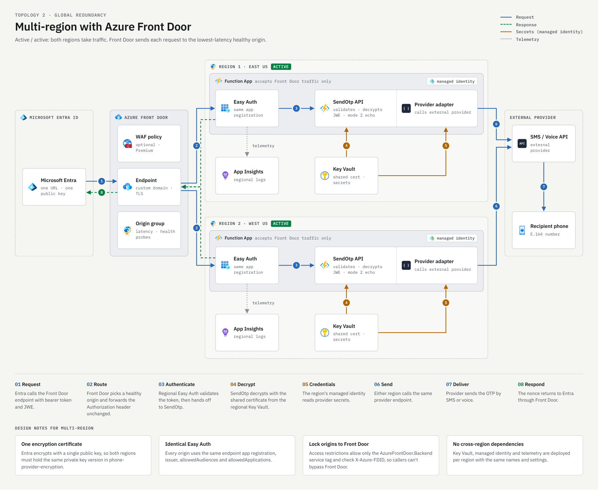

# Optional multi-region onboarding with Azure Front Door

Azure Front Door can provide **one public EPP URL backed by Function Apps in multiple regions**.
This is an optional, manually managed topology; the [main onboarding guide](../README.md) remains
the starting point for a single-region deployment.

**No Front Door deployment script is provided.** The guided setup does not create or coordinate
this topology. This guide describes the configuration and validation responsibilities; it is not a
one-command deployment or a claim of interruption-free delivery.

## Scope and observed behavior

An isolated JavaScript evaluation deployment was tested with Front Door Standard, two and three
regional origins, a shared encryption certificate, and a separate non-delivering readiness handler.
Authenticated encrypted evaluation, rejection of invalid callers, origin access restrictions, and
controlled Function stop/restart behavior were exercised.

**The readiness handler used in testing is not part of the released sample.** You must implement
and validate the [readiness contract below](#3-provide-a-non-delivering-readiness-endpoint) before
enabling multi-origin health probes. There is no app setting that adds this endpoint to a release ZIP.
The same design can be applied to other runtimes, but .NET and Python multi-region behavior was not
validated in these trials.

Live SMS/voice delivery, real Entra service invocation and retry behavior, a complete Azure regional
outage, custom domains, WAF, Private Link, and production load were **not** validated. Complete
customer-specific testing before policy activation.

## Architecture: one URL, multiple origins

The diagram is a reference topology, not a deployment result. Region names are illustrative.
The custom domain and Premium/WAF elements are optional design choices, not features exercised in
the Standard-tier test. Use globally unique Function App, storage account, and Key Vault names;
regional identities and vault references also differ. Share the **logical configuration and RSA
key material**, not every literal resource name, identity ID, or vault-specific version identifier.
The SMS/voice arrows describe live delivery; evaluation returns the nonce without contacting the
phone provider.

| Component | Purpose |
|---|---|
| Front Door profile and endpoint | Provide the single hostname used by the caller. One endpoint is sufficient for regional redundancy. |
| Route | Match `/api/SendOtp` and forward the request to the EPP origin group over HTTPS. |
| Origin group | Contain the regional Function hostnames and their health, priority, weight, and latency settings. |
| Regional origin | Run the same selected implementation and provider integration, with local storage, Key Vault, identity, and telemetry. |

The caller uses `https://<front-door-host>/api/SendOtp`, not a list of regional URLs.
Front Door selects an eligible origin using health, priority, latency, and weight. Equal priorities
make both origins eligible; equal weights do **not** guarantee a 50/50 split. Adding a third region
normally adds an **origin**, not another customer-facing endpoint.

## 1. Plan the regional deployment

Start in a dedicated nonproduction tenant and subscription. Review the
[setup prerequisites](../setup/docs/README.md#prerequisites-for-step-2) and
[regional quota guidance](../setup/docs/Troubleshooting.md#deployment-fails-with-subscriptionisoverquotaforsku).

- Choose two regions initially, based on service availability, capacity, residency, and the selected
  Security Store provider's requirements. A third region adds cost and capacity, but does not
  inherently shorten failure detection.
- Check availability of **every** required resource type, not just EP1 quota. Hosting availability
  does not establish that Application Insights or other dependencies are available in that region.
- Budget for an EP1 plan and regional dependencies in each region, Front Door, and telemetry.
  Keep enough warm capacity for the remaining origins to handle traffic during an outage.
- Choose one language and deploy identical, verified package bytes to each origin. Do not mix
  implementations or package versions while measuring failover.
- Record the endpoint application's client ID, validated token audience and issuer, authorized
  caller application ID, certificate/public-key identity, selected provider route, and regional owners.
- Plan manual rollout, validation, certificate renewal, monitoring, and rollback before activation.

**Do not simply rerun `Setup-Epp.ps1` in another region against the same application.** It is a
single-region setup flow and does not coordinate Front Door, shared key material, regional
registrations, or failover. Independent certificate issuance or a setup rerun can change app
configuration or close ingress on an existing endpoint.

## 2. Prepare equivalent, independently provisioned origins

Provision each regional Function App and its dependencies manually through your approved Azure
process. Keep ingress closed while setting up trust, keys, identities, and packages.

1. Use the same endpoint application and validated issuer/audience/caller policy on every origin.
   Enable Easy Auth with `requireAuthentication=true`, `Return401`, and HTTPS required.
   Keep a nonempty `allowedApplications` list pinned to the authorized caller.
2. Retain the same [SendOtp contract](CONTRACT.md#1-http-api). Front Door must preserve the caller's
   `Authorization` header and encrypted request body. Its hostname is not automatically the token
   audience, and its profile ID is not the caller application's ID.
3. **Do not enable Front Door managed-identity origin authentication on this route.** That feature
   replaces the `Authorization` header; this design requires the original caller token to reach
   Easy Auth. Managed identity is still used by each Function for its own Azure dependencies.
4. Deploy the same package using private storage and managed-identity access. Keep SCM/basic
   publishing authentication protections in place; do not open administrative endpoints to bypass
   a deployment failure.
5. Configure the selected Security Store integration consistently in every region. Use each
   region's own credential vault and identities; complete provider consent or credential setup as
   required. If the integration uses managed-identity federation, configure trust for each regional
   outbound identity on the authorized client application; do not reuse another region's identity ID.
   Do not forward the incoming caller token to the provider.
6. Configure regional Application Insights/Log Analytics and verify ingestion. Avoid making a
   serving origin depend on another region's credential vault or package storage.

### Coordinate the encryption key

The caller must be able to encrypt once for any eligible origin. Every origin therefore needs the
**same RSA private key corresponding to the registered public certificate**. Front Door's HTTPS
certificate is separate from this JWE encryption certificate.

- Use an approved secure replication process. The test used Key Vault certificate backup/restore,
  which transfers an Azure-encrypted backup rather than a plaintext private key.
- Key Vault backup/restore is restricted to the **same subscription and Azure geography**. Do not
  assume it works across arbitrary subscriptions or geographies; obtain an approved alternative
  design if these constraints do not fit.
- Give each Function identity scoped access to its regional vault. Set `EPP_DECRYPTION_KEY_PEM`
  to the regional certificate's **versioned PEM backing-secret reference**.
- Verify matching public-key material and successful decryption in every region. Comparing only
  vault names or secret-version strings is insufficient.
- Restored certificates are independent copies, not automatic synchronization. Coordinate renewal
  and Entra updates across every origin using the [certificate lifecycle guidance](../setup/docs/README.md#encryption-certificate-lifecycle).
  That section explains the single-key constraints; apply the multi-region updates through an
  approved manual procedure, not independent setup reruns. The sample has one active decryption
  key; it does not implement overlapping multi-key rotation.
- Keep plaintext keys out of source, logs, tickets, and pipeline artifacts. Protect and remove
  temporary encrypted backups under your approved handling policy.

## 3. Provide a non-delivering readiness endpoint

Front Door's health probes do not carry the Entra caller token. Probing the protected `SendOtp`
endpoint would test authentication failure rather than application readiness.

Implement a separate route such as **`/api/health/ready`** with this contract:

- Support HTTPS `HEAD` and `GET`; return no response body for `HEAD`.
- Return `200` only when the handler is running and the configured RSA decryption key is usable.
  Return a generic `503` when not ready.
- Do not send an OTP or call a phone provider. Do not return a nonce, keys, credentials, or detailed
  configuration. Use `Cache-Control: no-store`.
- If the route requires an Easy Auth exemption, exempt **only that exact readiness path**.
  Never exempt `/api/SendOtp`, `/api/*`, or the whole application.
- Keep the origin-level Front Door access restrictions described below on the readiness route too.

Readiness proves neither provider availability nor handset delivery. Validate those separately.
Do not point probes at a nonexistent handler, use a cached static `200`, or disable Easy Auth to
make probes succeed. Front Door treats only a `200` probe response as healthy.
If every origin is unhealthy, Front Door can still route requests across them. Keep authentication
and application failure handling effective independently of probe status.

## 4. Configure Front Door manually

In the Azure portal, create a Front Door Standard/Premium profile, an endpoint, and an origin group.
The following values describe the **tested starting configuration**, not universal performance defaults:

| Setting | Tested value |
|---|---|
| Tier and domain | Standard, using its generated `azurefd.net` hostname |
| Origin hostnames | Each Function App's actual default hostname |
| Origin host header | That origin's Function hostname, not the Front Door hostname |
| Origin transport | HTTPS, port 443, certificate-name validation enabled |
| Origin priority and weight | Priority `1`, weight `1000` for every origin |
| Session affinity | Disabled |
| Health probe | HTTPS `HEAD` to the implemented `/api/health/ready` route |
| Probe interval | 30 seconds |
| Sample size / required successes | 4 / 3 |
| Additional latency | 50 milliseconds |
| Origin response timeout | 30 seconds; this is not the caller's OTP deadline |
| Route paths | `/api/SendOtp` and the implemented readiness path |
| Accepted/forwarding protocol | HTTPS only |
| Link to default domain | Enabled |
| Caching | Disabled |

Create the route under **Front Door manager**, associate it with the endpoint's domain, and select
the origin group. Inspect **Origin groups > your group > Origins** to see the regional backends.
One public endpoint with several origins is expected.

Use the same request body and caller authorization end to end. Do not add header-replacement,
redirect, cache, or retry rules without separately validating their effect on authentication and OTP
delivery. A cached response cannot acknowledge a new delivery request; Front Door does not cache POST.

### Restrict each origin to this Front Door profile

Before opening ingress for Front Door, configure Function App access restrictions:

1. Allow the **`AzureFrontDoor.Backend` service tag** with an additional **`X-Azure-FDID`** header
   condition matching this profile's Front Door ID.
2. Set unmatched requests to **Deny**. Both the source restriction and header condition are
   required; the header alone can be spoofed.
3. Keep Easy Auth enabled for SendOtp. Restricting the network path does not authenticate the caller.
4. Open only the access needed by this public-origin design after the configuration is verified.
   A publicly resolvable hostname does not mean direct requests should be allowed.

Premium with Private Link is an alternative origin-security design, but was not tested here.
WAF policies and custom domains also need separate configuration and validation.

## 5. Validate before manually activating policy

Use an approved test caller and synthetic encrypted **evaluation** requests first. Check returned
nonces locally without writing them or request bodies to shared logs.

- Confirm all origins use matching package bytes, usable regional key references, and the intended
  Easy Auth issuer, audience, and caller restrictions.
- Direct origin requests must be denied, including requests with a spoofed `X-Azure-FDID`.
- Through Front Door, missing/invalid/wrong-audience tokens and unauthorized callers must fail.
  Bracket unauthorized-caller testing with valid evaluation requests so a general outage is not
  mistaken for successful authorization enforcement.
- Valid encrypted evaluations must return the matching nonce. Malformed/tampered requests must
  not be accepted. Prove each origin participates using safe correlation IDs and regional telemetry.
- Send bounded continuous evaluation traffic **before, during, and after** a controlled test-origin
  outage. Keep the origin enabled in Front Door to test health-driven routing, not just manual removal.
- Record every failed response and transport error. Restore the origin even if testing fails, and
  verify that specific origin's readiness before testing another one. A shared readiness URL can
  succeed through a different origin.
- Correlate event timestamps, origin state, and client results. Do not use a delayed aggregate
  health-percentage graph as an exact outage-to-recovery timer.
- Separately test approved live SMS/voice delivery and caller behavior with the provider and EPP
  onboarding owner. Evaluation does not prove either.

Only after the required validations should an **Authentication Policy Administrator** follow the
[supported activation procedure](../setup/docs/README.md#step-3---manually-validate-and-activate-policy),
using the Front Door SendOtp URL and endpoint application client ID. Save the previous policy first;
preserve unrelated properties and read the change back. No policy change is automated by this guide.

## Observed failover results and limitations

These controlled JavaScript trials stopped a Function App, **not an entire Azure region**. All used
one observer in Central US and non-delivering encrypted evaluation. The two-origin deployment used
Central US and West US 2; the third origin was in West US 3. Central US was the stopped origin.
The sample-size/success threshold remained 4/3; the stopped origin was serving traffic before each outage.

| Origins | Probe interval | Failed requests in matched first 8 minutes | Sustained success after stop confirmation |
|---|---|---|---|
| 2 | 30 seconds | 32/478 (6.7%) | About 144 seconds |
| 2 | 10 seconds | 58/471 (12.3%) | About 154 seconds |
| 3 | 30 seconds | 33/462 (7.1%) | About 123 seconds |
| 3, repeat | 30 seconds | 32/460 (7.0%) | About 150 seconds |

Failures were mostly **HTTP 403**, with zero, one, two, and two transport errors respectively.
Transport errors were recorded as status `0`, which is not an HTTP status. No 5xx responses were
observed in these trials; a network or full-region outage can behave differently.

"Sustained success" is the successful sampled tail after the last failure, continuing for at least
30 seconds before restart. It is measured from management-plane stop confirmation, not the exact
physical failure time. Requests targeted roughly one per second, but slow responses/timeouts reduced
sample counts. One three-origin trial needed controller recovery and ran longer, so comparisons use
the same first-eight-minute window. Baseline and post-restart windows had no failed samples.

**This was not a complete Front Door outage, and it was not seamless failover.** Healthy origins
continued serving, but a 403 is still a failed request. A failed request is not guaranteed to be
replayed on another origin. The actual Entra caller's handling of these errors was not tested.

These small trials do not establish that 10-second probes or a third region improve reliability.
More regions can add capacity and failure tolerance; they do not eliminate detection/routing delays,
shared provider dependencies, or application faults. Faster probes increase probe traffic and can
make transient conditions affect routing more quickly. Define an acceptable failure budget and
repeat measurements for your caller locations and load.

Do not add blind retries to live sends: a timeout can occur after provider acceptance, and the sample
does not supply delivery deduplication. No zero-downtime, production SLA, or handset-delivery claim
follows from these evaluation results.

## Operations and rollback

- Monitor each origin, Front Door health-probe/access diagnostics, authentication failures, key
  reference resolution, certificate expiry, and provider outcomes. Never log OTP bodies, private keys,
  bearer tokens, or nonce values.
- Roll out package/configuration changes deliberately and validate each region. Restore failed test
  origins and verify they are serving; `Running` alone does not prove readiness.
- Keep the reviewed pre-change policy, origin access restrictions, authentication settings, and
  certificate-version references. If rolling back to a direct Function URL, first restore its
  approved single-region access policy **while retaining Easy Auth**, otherwise Front Door-only
  restrictions will block the direct caller.
- Have the policy administrator restore the reviewed URL/app ID through the supported procedure,
  read it back, and validate delivery. Do not delete resources as a substitute for policy rollback.
- Retire extra resources only after traffic and policy rollback are confirmed. Front Door, regional
  plans, and telemetry remain billable until appropriately decommissioned; respect Key Vault purge
  protection and retention.

## References

- [Front Door routing methods](https://learn.microsoft.com/azure/frontdoor/routing-methods)
- [Health probes and all-origins-unhealthy behavior](https://learn.microsoft.com/azure/frontdoor/health-probes)
- [Origin security and caller-header considerations](https://learn.microsoft.com/azure/frontdoor/origin-security)
- [Front Door caching](https://learn.microsoft.com/azure/frontdoor/front-door-caching)
- [Key Vault backup/restore constraints](https://learn.microsoft.com/azure/key-vault/general/backup)
